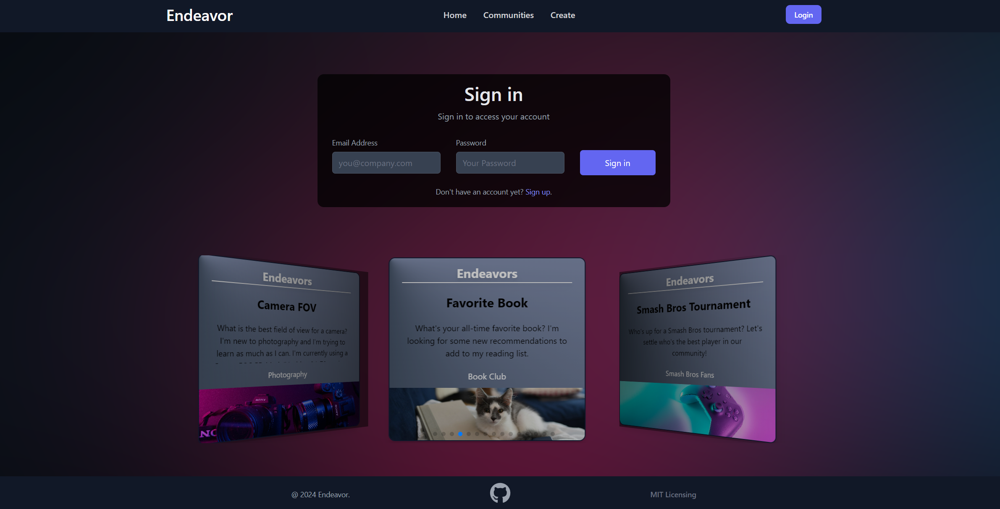

# Endeavor: MERN Stack Single-Page Application

[](https://opensource.org/licenses/MIT)   

## Table of Contents

- [Description](#description)
- [Installation](#installation)
- [Usage](#usage)
- [Screenshot](#screenshot)
- [Application Link](#application-link)
- [Credits](#credits)
- [Future Developments](#future-developments)
- [Contribute](#contribute)
- [License](#license)
- [Questions](#questions)

## Description

Endeavor is a MERN stack application that allows users to create, join, and manage events and activities. It's a great way to connect with others who share your interests! Users are able
to create an account, create events, join events, and (in the a future development) leave comments. The application is built with React, Node.js, Express, and MongoDB. It's a full-stack application that was built with the agile development process. This MERN stack single page application was an assignment from the Ohio State University Coding Bootcamp.

## Acceptance Criteria

```md
* Use React for the front end.

* Use GraphQL with a Node.js and Express.js server.

* Use MongoDB and the Mongoose ODM for the database.

* Use queries and mutations for retrieving, adding, updating, and deleting data.

* Be deployed using Heroku (with data).

* Have a polished UI.

* Be responsive.

* Be interactive (i.e., accept and respond to user input).

* Include authentication (JWT).

* Protect sensitive API key information on the server.

* Have a clean repository that meets quality coding standards (file structure, naming conventions, best practices for class and id naming conventions, indentation, high-quality comments, etc.).

* Have a high-quality README (with unique name, description, technologies used, screenshot, and link to deployed application).

```


## Installation
 - [Visual Studio Code](https://code.visualstudio.com/)
 - [Node.js](https://nodejs.org/en)
 - [React](https://react.dev/)
 - [Express](https://expressjs.com/)
 - [React](https://react.dev/)
 - [Vite](https://vitejs.dev/)
 - [Mongoose](https://mongoosejs.com/)
 - [MongoDB Atlas](https://www.mongodb.com/docs/atlas/)
 - [GraphQL](https://www.npmjs.com/package/graphql)
 - [Tailwind](https://tailwindcss.com/)
 - [Swiper](https://swiperjs.com/)
 - [JsonWebToken](https://www.npmjs.com/package/jsonwebtoken)
 - [React-router-dom](https://www.npmjs.com/package/react-router-dom/v/6.11.1)
 - To see a full list, refer to package.json files
       

## Usage

1. Clone the repository to your local computer.
2. From the root directory, run `npm install` to install dependencies.
3. Run `npm run seed` to seed the database, install [mongoDB](https://www.mongodb.com/docs/manual/tutorial/install-mongodb-on-windows/) if you do not have it first.
4. Run `npm run develop` to run the application and open it in the browser.


## Screenshot


<details>
  <summary>Click Arrow for Screenshot Collection</summary>
  
  
  
  
  
</details>


## Application Link

- [Primary Link](https://damp-eyrie-37046-16c1825e195d.herokuapp.com/)

- [Secondary Link](https://safe-beyond-33631-d669d82cc99d.herokuapp.com/)

## Credits

 - This application is an assignment from [The Ohio State University Coding Boot Camp](https://eng-bootcamps.osu.edu/).  The Acceptance Criteria above is from the Project 3. 
 - Activity course materials were used to help complete this application.
 - All free images are from [UnSplash](https://unsplash.com/) 
 
## Future Developments

  - Additional functionality to the single Endeavor and Community pages
  - Upload Picture integration and possible map location for Endeavors
  - Search functionality
  - More styling updates
  - Stripe integration

## Contribute 

If you would like to contribute please use the [Contributor Covenant](https://www.contributor-covenant.org/).


## License

[](https://opensource.org/licenses/MIT)   

***MIT License***

## Questions

 - Github Profiles for [neph](https://github.com/nephh), [rickibobbii](https://github.com/rickibobbii), [jaredbyrum](https://github.com/jaredbyrum)